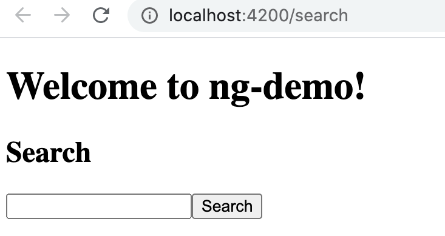
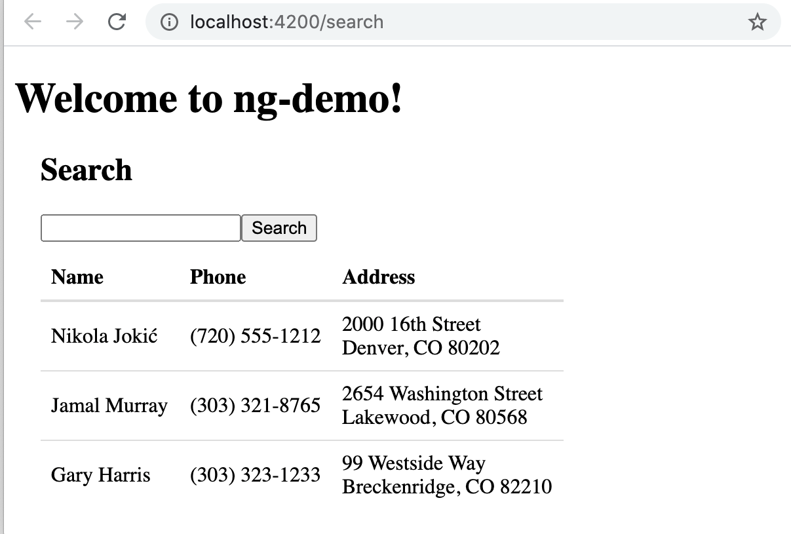
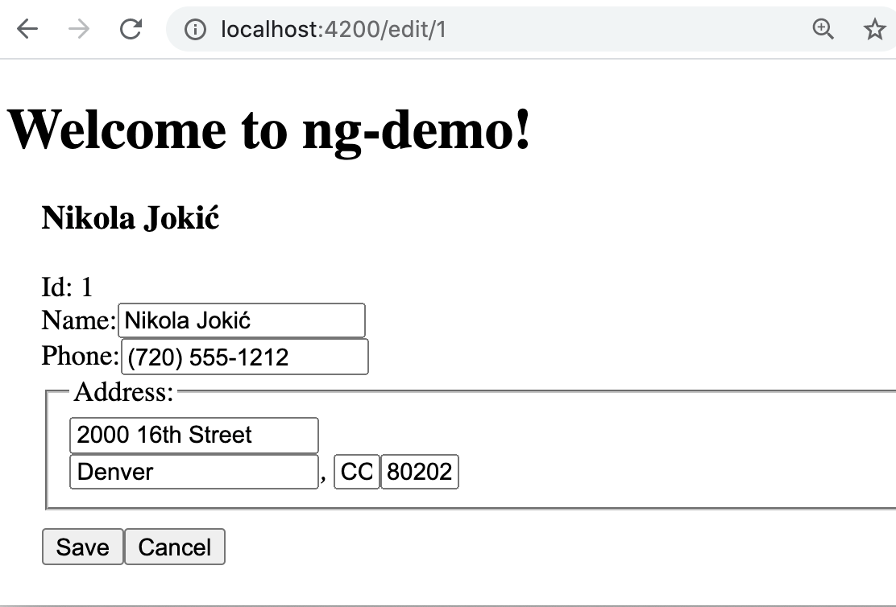

== What you'll build

You'll build a simple web application with Angular CLI, a tool for Angular development. You'll create an application with search and edit features.

== What you'll need

* About 30 minutes.
* A favorite text editor or Visual Studio Code. I recommend Visual Studio Code
* http://nodejs.org/[Node.js] and npm installed.
* https://github.com/angular/angular-cli[Angular CLI] installed. If you don't have Angular CLI installed, install it using `npm install -g @angular/cli@10.1.0`.

== Create your project

Create a new project using the `ng new` command:

----
ng new ng-demo
----

When prompted to install Angular routing, type "Y". For the stylesheet format, choose "CSS" (the default).

This will create a `ng-demo` project and run `npm install` in it. It takes about a minute to complete,
but will vary based on your internet connection speed.

You can see the what version of Angular CLI you're using with `ng version`.

----
$ ng version

     _                      _                 ____ _     ___
    / \   _ __   __ _ _   _| | __ _ _ __     / ___| |   |_ _|
   / △ \ | '_ \ / _` | | | | |/ _` | '__|   | |   | |    | |
  / ___ \| | | | (_| | |_| | | (_| | |      | |___| |___ | |
 /_/   \_\_| |_|\__, |\__,_|_|\__,_|_|       \____|_____|___|
                |___/

Angular CLI: 10.1.0
Node: 14.8.0
OS: darwin x64

Angular:
...
Ivy Workspace:

Package                      Version
------------------------------------------------------
@angular-devkit/architect    0.1001.0
@angular-devkit/core         10.1.0
@angular-devkit/schematics   10.1.0
@schematics/angular          10.1.0
@schematics/update           0.1001.0
rxjs                         6.6.2
----

If you run this command from the `ng-demo` directory, you'll see even more information.

----
     _                      _                 ____ _     ___
    / \   _ __   __ _ _   _| | __ _ _ __     / ___| |   |_ _|
   / △ \ | '_ \ / _` | | | | |/ _` | '__|   | |   | |    | |
  / ___ \| | | | (_| | |_| | | (_| | |      | |___| |___ | |
 /_/   \_\_| |_|\__, |\__,_|_|\__,_|_|       \____|_____|___|
                |___/

Angular CLI: 10.1.0
Node: 14.8.0
OS: darwin x64

Angular: 10.1.0
... animations, cli, common, compiler, compiler-cli, core, forms
... platform-browser, platform-browser-dynamic, router
Ivy Workspace: Yes

Package                           Version
-----------------------------------------------------------
@angular-devkit/architect         0.1001.0
@angular-devkit/build-angular     0.1001.0
@angular-devkit/build-optimizer   0.1001.0
@angular-devkit/build-webpack     0.1001.0
@angular-devkit/core              10.1.0
@angular-devkit/schematics        10.1.0
@ngtools/webpack                  10.1.0
@schematics/angular               10.1.0
@schematics/update                0.1001.0
rxjs                              6.6.2
typescript                        4.0.2
webpack                           4.44.1
----

== Run the application

The project is configured with a simple web server for development. To start it, run:

----
ng serve
----

== Add a search feature

To add a search feature, open the project in an Visual Studio Code or your favorite text editor.

=== The Basics

In a terminal window, cd into your project's directory and run the following command to create a search component.

[source]
----
ng g component search
----

Open `src/app/search/search.component.html` and replace its default HTML with the following:

[source,html]
.src/app/search/search.component.html
----
<h2>Search</h2>
<form>
  <input type="search" name="query" [(ngModel)]="query" (keyup.enter)="search()">
  <button type="button" (click)="search()">Search</button>
</form>
<pre>{{searchResults | json}}</pre>
----

If you try to start your app at this point, you'll receive a compilation error.

----
ERROR in src/app/search/search.component.html:3:50 - error TS2339:
 Property 'query' does not exist on type 'SearchComponent'.
----

To fix this, add a `query` property to `src/app/search/search.component.ts`. While you're there, add a `searchResults` property and an empty `search()` method.

[source,typescript]
.src/app/search/search.component.ts
----
export class SearchComponent implements OnInit {
  query: string;
  searchResults: any;

  constructor() { }

  ngOnInit(): void { }

  search(): void { }

}
----

.Adding a Search Route
****

The https://angular.io/guide/router[Router and navigation docs] for Angular provides the information you need to setup a route to the `SearchComponent` you just generated. Here's a quick summary:

In `src/app/app-routing.module.ts`, modify the `routes` constant to add `SearchComponent` as the default:

[source,typescript]
.src/app/app-routing.module.ts
----
import { SearchComponent } from './search/search.component';

const routes: Routes = [
  { path: 'search', component: SearchComponent },
  { path: '', redirectTo: '/search', pathMatch: 'full' }
];
----
****

Run `ng serve` again you will see a compilation error.

----
ERROR in src/app/search/search.component.html:3:37 - error NG8002:
 Can't bind to 'ngModel' since it isn't a known property of 'input'.
----

To solve this, open `src/app/app.module.ts` and add `FormsModule` as an import in `@NgModule`:

[source,typescript]
.src/app/app.module.ts
----
import { FormsModule } from '@angular/forms';

@NgModule({
  ...
  imports: [
    ...
    FormsModule
  ]
  ...
})
export class AppModule { }
----

Now you should be able to see the search form.

[[search-component]]
.Search component

If yours looks different, it's because I trimmed my `app.component.html` to the bare minimum.

[source,html]
.src/app/app.component.html
----
<h1>Welcome to {{ title }}!</h1>

<router-outlet></router-outlet>
----

If you want to add CSS for this component, open `src/app/search/search.component.css` and add some CSS. For example:

[source,css]
.src/app/search/search.component.css
----
:host {
  display: block;
  padding: 0 20px;
}
----

This section has shown you how to generate a new component and add it to a basic Angular application with Angular CLI. The next section shows you how to create and use a JSON file and `localStorage` to create a fake API.

=== The Backend

To get search results, create a `SearchService` that makes HTTP requests to a JSON file. Start by generating a new service.

----
ng g service shared/search/search
----

Create `src/assets/data/people.json` to hold your data.

----
mkdir -p src/assets/data
----

[source,json]
.src/assets/data/people.json
----
[
  {
    "id": 1,
    "name": "Nikola Jokić",
    "phone": "(720) 555-1212",
    "address": {
      "street": "2000 16th Street",
      "city": "Denver",
      "state": "CO",
      "zip": "80202"
    }
  },
  {
    "id": 2,
    "name": "Jamal Murray",
    "phone": "(303) 321-8765",
    "address": {
      "street": "2654 Washington Street",
      "city": "Lakewood",
      "state": "CO",
      "zip": "80568"
    }
  },
  {
    "id": 3,
    "name": "Gary Harris",
    "phone": "(303) 323-1233",
    "address": {
      "street": "99 Westside Way",
      "city": "Breckenridge",
      "state": "CO",
      "zip": "82210"
    }
  }
]
----

Modify `src/app/shared/search/search.service.ts` and provide `HttpClient` as a dependency in its constructor.

In this same file, create a `getAll()` method to gather all the people. Also, define the `Address` and `Person` classes that JSON will be marshalled to.

[source,typescript]
.src/app/shared/search/search.service.ts
----
import { Injectable } from '@angular/core';
import { HttpClient } from '@angular/common/http';

@Injectable({
  providedIn: 'root'
})
export class SearchService {

  constructor(private http: HttpClient) { }

  getAll() {
    return this.http.get('assets/data/people.json');
  }
}

export class Address {
  street: string;
  city: string;
  state: string;
  zip: string;

  constructor(obj?: any) {
    this.street = obj && obj.street || null;
    this.city = obj && obj.city || null;
    this.state = obj && obj.state || null;
    this.zip = obj && obj.zip || null;
  }
}

export class Person {
  id: number;
  name: string;
  phone: string;
  address: Address;

  constructor(obj?: any) {
    this.id = obj && Number(obj.id) || null;
    this.name = obj && obj.name || null;
    this.phone = obj && obj.phone || null;
    this.address = obj && obj.address || null;
  }
}
----

To make these classes easier to consume by your components, create `src/app/shared/index.ts` and add the following:

[source,typescript]
.src/app/shared/index.ts
----
export * from './search/search.service';
----

The reason for creating this file is so you can import multiple classes on a single line rather than having to import each individual class on separate lines.

In `search.component.ts`, add imports for these classes.

[source,typescript]
.src/app/search/search.component.ts
----
import { Person, SearchService } from '../shared';
----

You can now add a proper type to the `searchResults` variable. While you're there, modify the constructor to inject the `SearchService`.

[source,typescript]
.src/app/search/search.component.ts
----
export class SearchComponent implements OnInit {
  query: string;
  searchResults: Array<Person>;

  constructor(private searchService: SearchService) { }
----

Then update the `search()` method to call the service's `getAll()` method.

[source,typescript]
.src/app/search/search.component.ts
----
search(): void {
  this.searchService.getAll().subscribe(
    (data: any) => { this.searchResults = data; },
    error => console.log(error)
  );
}
----

At this point, you'll likely see the following message in your browser's console.

----
NullInjectorError: No provider for HttpClient!
----

To fix the "No provider" error from above, update `app.module.ts` to import `HttpClientModule`.

[source,typescript]
.src/app/app.module.ts
----
import { HttpClientModule } from '@angular/common/http';

@NgModule({
  ...
  imports: [
    ...
    HttpClientModule
  ],
  providers: [],
  bootstrap: [AppComponent]
})
----

Now clicking the search button should work. To make the results look better, remove the `<pre>` tag and replace it with a `<table>` in `search.component.html`.

[source,xml]
.src/app/search/search.component.html
----
<table *ngIf="searchResults">
  <thead>
  <tr>
    <th>Name</th>
    <th>Phone</th>
    <th>Address</th>
  </tr>
  </thead>
  <tbody>
  <tr *ngFor="let person of searchResults; let i=index">
    <td>{{person.name}}</td>
    <td>{{person.phone}}</td>
    <td>{{person.address.street}} 
      {{person.address.city}}, {{person.address.state}} {{person.address.zip}}
    </td>
  </tr>
  </tbody>
</table>
----

Then add some additional CSS to `search.component.css` to improve its table layout.

[source,css]
.src/app/search/search.component.css
----
table {
  margin-top: 10px;
  border-collapse: collapse;
}

th {
  text-align: left;
  border-bottom: 2px solid #ddd;
  padding: 8px;
}

td {
  border-top: 1px solid #ddd;
  padding: 8px;
}
----

Now the search results look better.

[[search-results]]
.Search results

But wait, you still don't have search functionality! To add a search feature, add a `search()` method to `SearchService`.

[source,typescript]
.src/app/shared/search/search.service.ts
----
import { Observable } from 'rxjs';
import { map } from 'rxjs/operators';
...

  search(q: string): Observable<any> {
    if (!q || q === '*') {
      q = '';
    } else {
      q = q.toLowerCase();
    }
    return this.getAll().pipe(
      map((data: any) => data
        .filter(item => JSON.stringify(item).toLowerCase().includes(q)))
    );
  }
----

Then refactor `SearchComponent` to call this method with its `query` variable.

[source,typescript]
.src/app/search/search.component.ts
----
search(): void {
  this.searchService.search(this.query).subscribe(
    (data: any) => { this.searchResults = data; },
    error => console.log(error)
  );
}
----

Now search results will be filtered by the query value you type in.

This section showed you how to fetch and display search results. The next section builds on this and shows how to edit and save a record.

== Add an edit feature

Modify `search.component.html` to wrap the person's name with a link.

[source,html]
.src/app/search/search.component.html
----
<td><a [routerLink]="['/edit', person.id]">{{person.name}}</a></td>
----

Run the following command to generate an `EditComponent`.

[source]
----
ng g component edit
----

Add a route for this component in `app-routing.module.ts`:

[source,typescript]
.src/app/app-routing.module.ts
----
import { EditComponent } from './edit/edit.component';

const routes: Routes = [
  { path: 'search', component: SearchComponent },
  { path: 'edit/:id', component: EditComponent },
  { path: '', redirectTo: '/search', pathMatch: 'full' }
];
----

Update `src/app/edit/edit.component.html` to display an editable form. You might notice I've added `id` attributes to most elements. This is to make things easier when writing integration tests with Protractor.

[source,html]
.src/app/edit/edit.component.html
----

  <h3>{{editName}}</h3>
  

    <label>Id:</label>
    {{person.id}}
  

  

    <label>Name:</label>
    <input [(ngModel)]="editName" name="name" id="name" placeholder="name"/>
  

  

    <label>Phone:</label>
    <input [(ngModel)]="editPhone" name="phone" id="phone" placeholder="Phone"/>
  

  <fieldset>
    <legend>Address:</legend>
    <address>
      <input [(ngModel)]="editAddress.street" id="street"> 
      <input [(ngModel)]="editAddress.city" id="city">,
      <input [(ngModel)]="editAddress.state" id="state" size="2">
      <input [(ngModel)]="editAddress.zip" id="zip" size="5">
    </address>
  </fieldset>
  <button (click)="save()" id="save">Save</button>
  <button (click)="cancel()" id="cancel">Cancel</button>

----

Modify `EditComponent` to import model and service classes and to use the `SearchService` to get data.

[source,typescript]
.src/app/edit/edit.component.ts
----
import { Component, OnInit, OnDestroy } from '@angular/core';
import { Address, Person, SearchService } from '../shared';
import { Subscription } from 'rxjs';
import { ActivatedRoute, Router } from '@angular/router';

@Component({
  selector: 'app-edit',
  templateUrl: './edit.component.html',
  styleUrls: ['./edit.component.css']
})
export class EditComponent implements OnInit, OnDestroy {
  person: Person;
  editName: string;
  editPhone: string;
  editAddress: Address;

  sub: Subscription;

  constructor(private route: ActivatedRoute,
              private router: Router,
              private service: SearchService) {
  }

  ngOnInit(): void {
    this.sub = this.route.params.subscribe(params => {
      const id = + params.id; // (+) converts string 'id' to a number
      this.service.get(id).subscribe(person => {
        if (person) {
          this.editName = person.name;
          this.editPhone = person.phone;
          this.editAddress = person.address;
          this.person = person;
        } else {
          this.gotoList();
        }
      });
    });
  }

  ngOnDestroy(): void {
    if (this.sub) {
      this.sub.unsubscribe();
    }
  }

  cancel() {
    this.router.navigate(['/search']);
  }

  save() {
    this.person.name = this.editName;
    this.person.phone = this.editPhone;
    this.person.address = this.editAddress;
    this.service.save(this.person);
    this.gotoList();
  }

  gotoList() {
    if (this.person) {
      this.router.navigate(['/search', {term: this.person.name} ]);
    } else {
      this.router.navigate(['/search']);
    }
  }
}
----

Modify `SearchService` to contain functions for finding a person by their id, and saving them. While you're in there, modify the `search()` method to be aware of updated objects in `localStorage`.

[source,typescript]
.src/app/shared/search/search.service.ts
----
search(q: string): Observable<any> {
  if (!q || q === '*') {
    q = '';
  } else {
    q = q.toLowerCase();
  }
  return this.getAll().pipe(
    map((data: any) => data
        .map(item => !!localStorage['person' + item.id] ?
          JSON.parse(localStorage['person' + item.id]) : item)
        .filter(item => JSON.stringify(item).toLowerCase().includes(q))
    ));
}

get(id: number) {
  return this.getAll().pipe(map((all: any) => {
    if (localStorage['person' + id]) {
      return JSON.parse(localStorage['person' + id]);
    }
    return all.find(e => e.id === id);
  }));
}

save(person: Person) {
  localStorage['person' + person.id] = JSON.stringify(person);
}
----

You can add CSS to `src/app/edit/edit.component.css` if you want to make the form look a bit better.

[source,css]
.src/app/edit/edit.component.css
----
:host {
  display: block;
  padding: 0 20px;
}

button {
  margin-top: 10px;
}
----

At this point, you should be able to search for a person and update their information.

[[edit-form]]
.Edit component

The &lt;form> in `src/app/edit/edit.component.html` calls a `save()` function to update a person's data. You already implemented this above.
The function calls a `gotoList()` function that appends the person's name to the URL when sending the user back to the search screen.

[source,typescript]
.src/app/edit/edit.component.ts
----
gotoList() {
  if (this.person) {
    this.router.navigate(['/search', {term: this.person.name} ]);
  } else {
    this.router.navigate(['/search']);
  }
}
----

Since the `SearchComponent` doesn't execute a search automatically when you execute this URL, add the following logic to do so in its `ngOnInit` method.

[source,typescript]
.src/app/search/search.component.ts
----
import { ActivatedRoute } from '@angular/router';
import { Subscription } from 'rxjs';
...

sub: Subscription;

constructor(private searchService: SearchService, private route: ActivatedRoute) { }

  ngOnInit(): void {
    this.sub = this.route.params.subscribe(params => {
      if (params.term) {
        this.query = decodeURIComponent(params.term);
        this.search();
      }
    });
  }
----

You'll want to implement `OnDestroy` and define the `ngOnDestroy` method to clean up this subscription.

[source,typescript]
.src/app/search/search.component.ts
----
import { Component, OnInit, OnDestroy } from '@angular/core';

export class SearchComponent implements OnInit, OnDestroy {
...
  ngOnDestroy(): void {
    if (this.sub) {
      this.sub.unsubscribe();
    }
  }
}
----

After making all these changes, you should be able to search/edit/update a person's information. If it works - nice job!

=== Form Validation

One thing you might notice is you can clear any input element in the form and save it. At the very least, the `name` field should be required. Otherwise, there's nothing to click on in the search results.

To make name required, modify `edit.component.html` to add a `required` attribute to the name `<input>` and bind it to Angular's validation with `#name="ngModel"`. Add a `
` next to the field to display an error message when validation fails.

[source,html]
.src/app/edit/edit.component.html
----
<input [(ngModel)]="editName" name="name" id="name" placeholder="name" required #name="ngModel"/>

  Name is required

----

You'll also need to wrap everything in a `<form>` element. Add `<form>` after the `<h3>` tag and close it before the last `
`. You'll also need to add an `(ngSubmit)` handler to the form, give it a name of `editForm`, and change the save button to be a regular submit button that's disabled when the form is invalid.

[source,html]
.src/app/edit/edit.component.html
----
<h3>{{editName}}</h3>
<form (ngSubmit)="save()" #editForm="ngForm">
  ...
  <button type="submit" id="save" [disabled]="!editForm.form.valid">Save</button>
  <button (click)="cancel()" id="cancel">Cancel</button>
</form>
----

After making these changes, the name field will be required.

